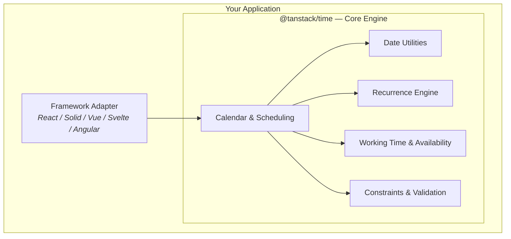

# TanStack Time

🤖⏰ Headless utilities for building time and calendar components in TS/JS, React, Solid, Vue, Svelte and Angular.

TanStack Time gives you the primitives you need to model dates, calendars, events, recurrences, working hours, and conflicts — without imposing any UI. Bring your own components and styling, and let the library handle the time math.

## What's in the Box

TanStack Time is organized into a framework-agnostic core and thin framework adapters. Install only the pieces you need.

### Core

- `@tanstack/time` — Headless date/calendar engine. Dates, ranges, parsing, formatting, recurrences, working time, event scheduling, and validation.

### Framework Adapters

- `@tanstack/react-time` — React hooks and controllers built on top of the core.
- `@tanstack/solid-time` — Solid primitives and controllers built on top of the core.
- Vue, Svelte, and Angular adapters are on the roadmap.

### Devtools

- `@tanstack/react-time-devtools` — Inspect calendar state, events, and operations inside TanStack Devtools.
- `@tanstack/solid-time-devtools` — Solid equivalent of the devtools plugin.

## Architecture

The **Core Engine** is a plain TypeScript/JavaScript library with no framework dependencies. Framework adapters subscribe to the core store and expose framework-native hooks and primitives.

## Key Features

- **Headless & Framework Agnostic**: Core logic runs anywhere. Adapters provide idiomatic React and Solid integrations today.
- **Date Primitives**: Parse, format, add, subtract, compare, round, clamp, and range dates with a consistent API.
- **Calendar Engine**: Create calendars with view modes, events, resources, and working calendars.
- **Feature System**: Compose behavior such as move, resize, recurrence, dependencies, constraints, and availability through opt-in features.
- **Working Time & Availability**: Model business hours, time-off, and resource capacity.
- **Validation**: Catch duration, constraint, dependency, and availability conflicts before saving events.
- **Devtools Integration**: Inspect state and operations with TanStack Devtools plugins.

## Next Steps

- [Installation](./installation) — Install the packages for your framework.
- [Quick Start](./quick-start) — Build your first calendar in a few minutes.
- [Core API Reference](./reference/index) — Browse the generated API docs.
